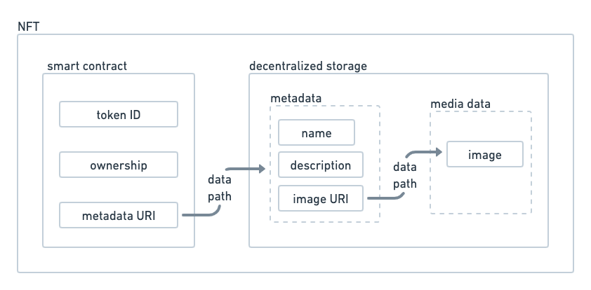
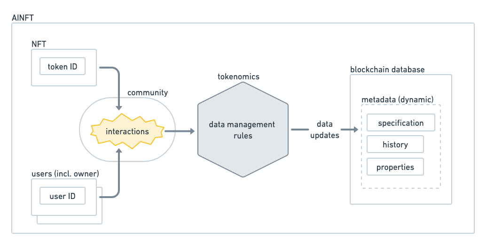

# AINFT

<figure><figcaption>
Figure 1. Structure of an NFT.
</figcaption></figure>

NFT (non-fungible token) is a digital ID system for assets. An NFT is represented as { contract address, token ID, ownership, metadata }. The metadata such as the token’s name, description, and image URI is usually stored in decentralized storage like IPFS, and the metadata’s storage address (e.g. token URI) along with the token ID and the ownership information is stored in a smart contract. Classical NFTs have static metadata, which means the metadata doesn’t change since its minting time.

<figure><figcaption>
Figure 2. Structure of an AINFT.
</figcaption></figure>

AINFT is an extension of NFT that has some additional logic attached to it. Often the logic is represented by some extra metadata including AI model specification. The metadata however doesn’t always have to be about artificial intelligence and it can be just some historical data about the NFT, e.g., interaction history between the NFT and users. This data is often dynamic as it can be updated as the AINFT or its community grows.

To make AINFT’s metadata meaningful, it needs to be managed in “trustable” manners, i.e., the update rules of the metadata, which is a core part of tokenomics, need to be applied securely and transparently with the consensus of the community. This can be achieved by storing the metadata in a blockchain database and having the data updates done publicly in the community. AINFT’s typical metadata includes:&#x20;

* specification — Specification of the token’s logic, e.g., AI model type, model parameters, etc&#x20;
* history — Epical data of the token, e.g., event history, reward history, user interaction history, etc&#x20;
* properties — Properties of the token, e.g. token type, token levels, credit balance, achievements, etc

The blockchain database for AINFT’s metadata needs to support dynamic state management including state read/write and permission control. [AIN Blockchain](https://medium.com/ai-network/bottt-ep-1-ain-blockchain-quick-intro-f0810c146e96) is a blockchain designed for such dynamic state management, and [AINFT Factory](https://docs.ainetwork.ai/ainfts/ainft-factory), which is a platform for building community tools for doing that, is adopting AIN Blockchain as a backend.

Persona NFT, which users can chat with, is an example of AINFT. The model information is stored as specification metadata, and the conversation history is stored as history metadata. The history data can be used as back-data for upgrading the token’s properties by the tokenomics.
