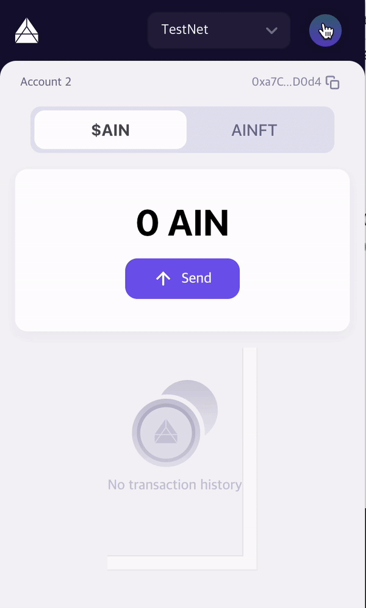

# Create AINFT object and Mint

You can create AINFT compliant 721 standard on AIN Blockchain. In this tutorial, We create AINFT on testnet and mint it.

### Requirement

* Node
* IDE (recommend VS Code)

### Step1. Initialize project

First, Create project to create AINFT. Make your directory and move it.

```bash
mkdir my-ainft
cd my-ainft
```

and Initialize project.

```bash
npm init
```

### Step2. Install ainft-js

Install ainft-js. We can create, mint and transfer AINFT with ainft-js.

```bash
npm install @ainft-team/ainft-js
```

### Step3. Create Account

Create account to create AINFT. If you have ain account, you can use it.

```typescript
const AinftJs = require('@ainft-team/ainft-js').default;

const account = AinftJs.createAccount();
console.log(account);

// {
//   address: '0x74703a44905daB6582d62A45705a1c3ff966523f',
//   private_key: ... ,
//   public_key: '9451c9c91f84ef5cc5f83fe86413c9eb283a6ba3924d0a351ac598c3895b9f6a57b10513a885a98aff8ccea2aa3101c07f799bcb25cbcb1184f67f6c2cb72541'
// }
```

If you have AIN Wallet, you can use account in Wallet.

Like below picture, you can export private key of account you want in wallet account setting.

<figure><figcaption><p>Export private key from ain wallet account</p></figcaption></figure>

### Step4. Get testnet ain from faucet

In order to create NFT, we need some ain. In Faucet, you can get some ain for tutorial. Enter your ain account address and get some ain.

> [https://faucet.ainetwork.ai/](https://faucet.ainetwork.ai/)

<figure><figcaption></figcaption></figure>

After then, you can check your balance in Wallet.

<figure><figcaption></figcaption></figure>

You can also check insight by entering the address in the search box at the top right.

> [https://testnet-insight.ainetwork.ai](https://testnet-insight.ainetwork.ai)

<figure><figcaption></figcaption></figure>

### Step5. Create Ainft object

Then, we’ll intialize ainft-js and create AINFT object. Use create function with NFT’s name and symbol you want. You can look appId, nftId and txHash as resulting in standard out. and You can check if transaction is completed by enter txHash in insight. Please check it and proceed to the next step.


```typescript
const config = {
  ainftServerEndpoint: 'https://ainft-api-dev.ainetwork.ai',
  ainBlockchainEndpoint: 'https://testnet-api.ainetwork.ai',
}
const ainftJs = new AinftJs('YOUR_PRIVATE_KEY', config);

const name = 'ainft_for_tutorial';
const symbol = 'TUTORIAL';

ainftJs.nft.create(name, symbol)
.then((res) => {
	const { txHash, ainftObject } = res;
	console.log(txHash);
	console.log(ainftObject.id);
	console.log(ainftObject.appId);
})
.catch((error) => {
	console.log(error);
});

// 0xe3c4c0e4982a7ebc1224d9e8ff84a86d17ff4facd5ac25e6bec2c9bfb32da8c2
// 0x799a71A8DDdECC23F1B15d222BcB01ae674751B8
// ainft721_0x799a71a8dddecc23f1b15d222bcb01ae674751b8
```


You can check the transaction results by entering the transaction hash in the search box at the top right.

> [https://testnet-insight.ainetwork.ai/](https://testnet-insight.ainetwork.ai/)

<figure><figcaption></figcaption></figure>

### Step6. Mint

Finally, Let’s mint AINFT. You can mint AINFT with tokenId you want to mint and the ain account address you want to receive AINFT.

You can see if transaction is complete by retrieving tx hash in insight.

```typescript
const to = '0x74703a44905daB6582d62A45705a1c3ff966523f'; // Replace to your receiver address.
const tokenId = '1'; // Replace to token Id you want.
const ainftObjectId = '0x799a71A8DDdECC23F1B15d222BcB01ae674751B8'; // Replace to your ainft object id.

const main = async () => {
  try {
    const ainftObject = await ainftJs.nft.get(ainftObjectId);
    const result = await ainftObject.mint(to, tokenId);
    console.log(result);
  } catch(error) {
    console.log(error);
  }
}

main();

// {
//   tx_hash: '0xbdca2430d425e78114a921eda073400cdf8ad9d4c05e8fda59931b39a69455f8',
//     result: {
//     gas_amount_total: { bandwidth: [Object], state: [Object] },
//     gas_cost_total: 0,
//       result_list: { '0': [Object], '1': [Object], '2': [Object], '3': [Object] },
//     gas_amount_charged: 0
//   }
// }
```

<figure><figcaption></figcaption></figure>

You can check minted AINFT in insight database!

<figure><figcaption></figcaption></figure>

Find out how to transfer AINFT issued in the next chapter!
