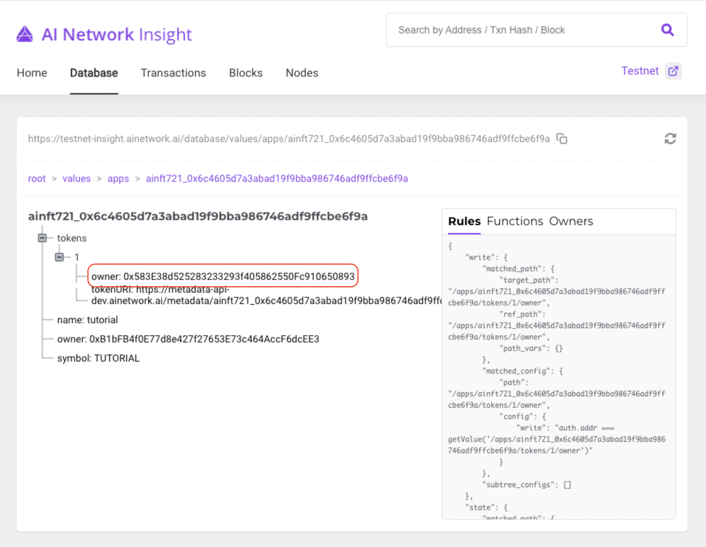

# Transfer AINFT

This tutorial describes how to transfer AINFT to other account with ainft-js. If you don’t have AINFT, See AINFT tutorial - Create & Mint.

### Transfer

You need an account that owns AINFT, nftId, tokenId and an address to receive.

```typescript
const AinftJs = require('@ainft-team/ainft-js').default;

const privateKey = 'TOKEN_OWNER_PRIVATE_KEY';
const config = {
  ainftServerEndpoint: 'https://ainft-api-dev.ainetwork.ai',
  ainBlockchainEndpoint: 'https://testnet-api.ainetwork.ai',
}
const ainftJs = new AinftJs(privateKey, config);
```

Then send the AINFT.

```jsx

const ainftObjectId = '0x6c4605D7a3abAd19f9BbA986746aDF9fFCBE6f9A'; // Replace to your ainft object Id.
const from = '0xB1bFB4f0E77d8e427f27653E73c464AccF6dcEE3'; // Replace to token owner address.
const to = '0x583E38d525283233293f405862550Fc910650893'; // Replace to receiver address.
const tokenId = '1'; // Replace your token Id.

const main = async () => {
	try {
		const ainftObject = await ainftJs.nft.get(ainftObjectId);
		const result = await ainftObject.transfer(from, to, tokenId);
		console.log(result);
	} catch(error) {
		console.log(error);
	}
}

main();

// {
//   tx_hash: '0x439bde3f9526119d037411eb0b4a27c22196ce4df93b982f2d627d47e3ed8a57',
//     result: {
//     gas_amount_total: { bandwidth: [Object], state: [Object] },
//     gas_cost_total: 0,
//       func_results: {
//       '0x6c4605D7a3abAd19f9BbA986746aDF9fFCBE6f9A_trigger_transfer': [Object]
//     },
//     code: 0,
//       bandwidth_gas_amount: 1,
//         gas_amount_charged: 0
//   }
// }
```

You can check if transaction is completed using `tx_hash` in insight.

> [https://testnet-insight.ainetwork.ai/](https://testnet-insight.ainetwork.ai/)

<figure><figcaption></figcaption></figure>

and In insight database, you can see updated owner information.

<figure><figcaption></figcaption></figure>
