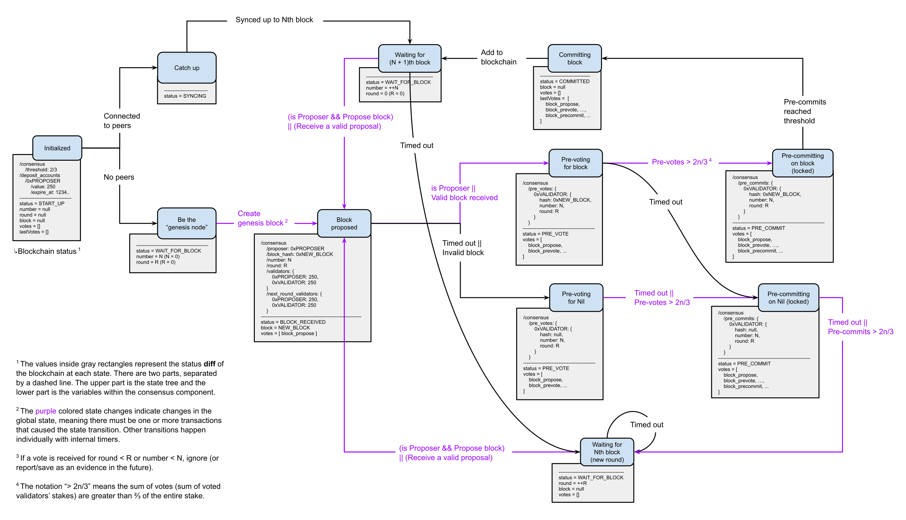

# Consensus

## Consensus on AI Network

AI Network's consensus algorithm is a version of [Tendermint](https://tendermint.com/docs/introduction/what-is-tendermint.html#consensus-overview)'s consensus algorithm with a modification that it's driven by rules. Like Tendermint, the process consists of 5 states and messages that validator nodes pass to each other that trigger state transitions. Nodes that stake AIN are called validators and one of the validators is selected to be the proposer of the next block. Proposer selection is done through evaluating the built-in proposer rule that uses the list of validators and their stakes as well as the current time to ensure that the process doesn't halt and will start a new round with the next candidate when the designated proposer is not reliable. Each validator has a chance to be a proposer with the probability proportional to its stake.

In Propose state, the selected proposer creates a block and broadcasts it to other validators. When broadcasting a block, a proposer not only sends the block but also writes the block's hash to the global state tree. If the proposal block is received within BLOCK\_CREATION\_INTERVAL and is verified, the validators accept it and move on to the Pre-vote state. If a block isn't received in time, new round begins with a new proposer selected. Once enough validators pre-vote on a block and the sum of their stakes reach the 2/3 threshold (at least the nodes who are staking 2/3 of the total stakes agree on the block), they start the Pre-commit state. Again this state requires 2/3 pre-commits to Commit to the block, which is the final state, and the process loops back to the Propose state.

Below is a state machine diagram of AIN Consensus algorithm, with related parts of the global state tree shown for a better understanding.

We plan to refine our consensus algorithm as AIN blockchain expands. One of the ways to do so is allowing each shard of the network to establish its own consensus rules within its community as AIN evolves and multiple shards are formed. We call this concept "configurable permissions and consensus protocols", and are planning to incorporate it into AIN in the future.&#x20;

Being able to configure its own consensus gives an application the power to appropriately prioritize and de-prioritize the three properties of a blockchain– scalability, security and decentralization. If an application needs scalability, it can maximize its throughput with simpler consensus rules. If an application needs more security, it can achieve stronger security by configuring permission-less Proof of Stake (PoS) rules. If an application is striving for more decentralization, it can simply adopt new consensus rules. There is no consensus lock-in so no forking will be required. Configurable consensus will make AIN inherently flexible and help the ecosystem adapt and grow as the requirements change.
