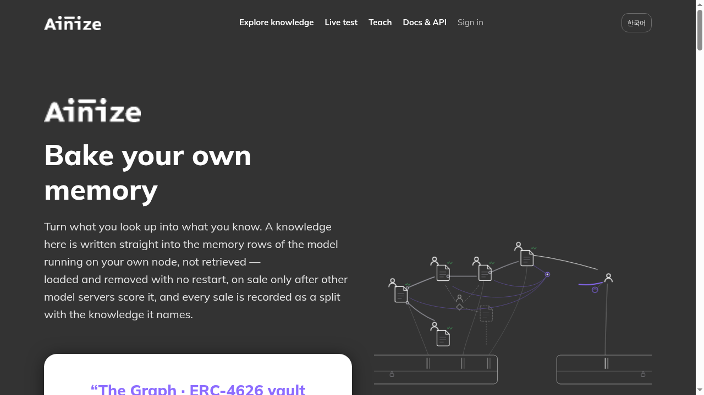
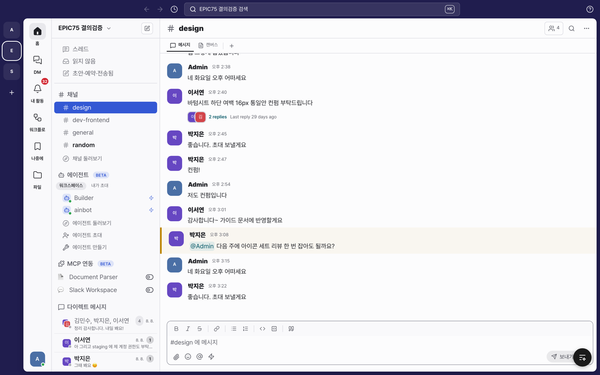
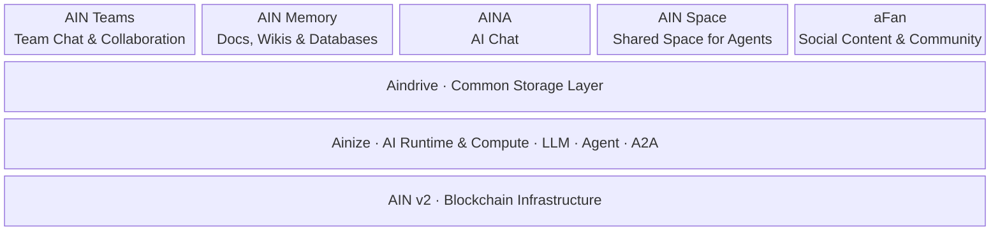
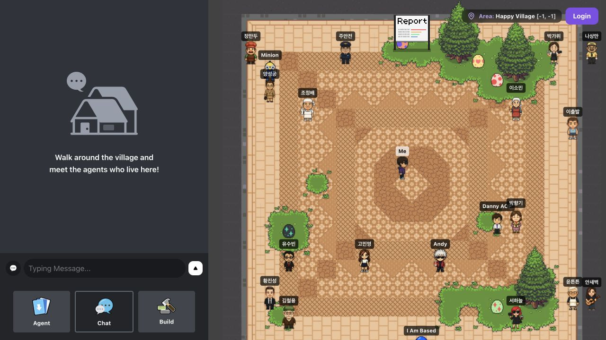
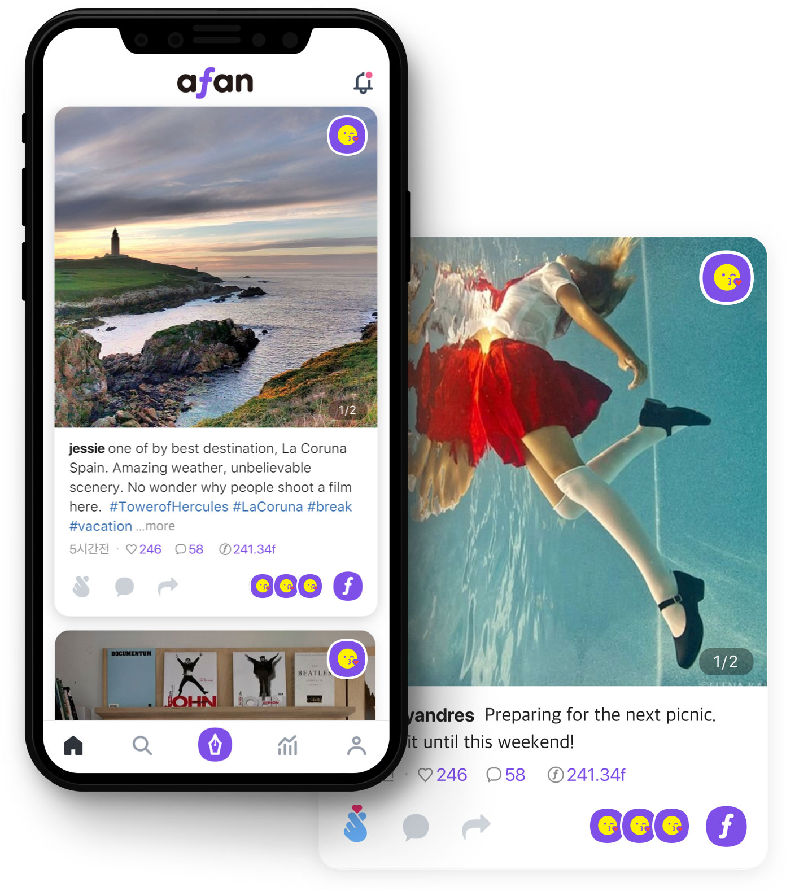

# AI Network 2026: An Ecosystem Where People and AI Grow Together

[한국어](ko.md) · **English**

> Ensure no human is left behind.

[AI Network's mission](https://www.ainetwork.ai/) is to build an AI ecosystem centered on people. As AI advances, more people should be able to put their knowledge and experience to use, build relationships, and create value together.

That requires a connection between the infrastructure that runs AI and the services people use every day. AI should help us understand our own materials, remember the conversations we share, and carry that context into our next project. Relationships that begin online also need places to continue in person.

AI Network is building these connections through AIN v2, Ainize, Aindrive, and five applications.

## What Each Product Does

### AIN v2 — The Blockchain Foundation

AIN v2 provides the blockchain foundation for network activity and execution records. It is developing into a shared basis for recording and verifying how AI services run and how participants contribute. Its role is to support that activity reliably as the ecosystem grows.

### Ainize — Where LLMs and Agents Run and Connect

Ainize provides model inference, agent execution, and connections between agents through A2A. Its knowledge training, verification, and sharing capabilities allow knowledge contributed by one participant to become useful to others. Developers can build on this execution layer and focus on the experience they want to create. [Ainize on GitHub](https://github.com/ainblockchain/ainize)

*Ainize's knowledge discovery and teaching interface. [Source](https://github.com/ainblockchain/ainize/blob/main/evidence/screenshots/ainize-ai-home.png)*

### Aindrive — A Shared Data Foundation

Aindrive lets people and agents work with files and folders on your devices according to the permissions you set. You choose which materials to share and who can access them. Services can then read and use those materials. Aindrive is designed to be a common storage layer that lets knowledge and work carry across applications. [Aindrive on GitHub](https://github.com/ainetwork-ai/aindrive)

### Five Applications — Collaboration, Knowledge, Conversation, Space, and Community

- **AIN Teams — Bring team conversations and work into one place.** A collaboration platform where people and AI agents work in the same channels. Organize conversations and files by project, invite agents to research topics or draft documents, and review their progress and results in the conversation. AIN Teams brings work to the place where the team is already talking.
- **AIN Memory — Bring documents and knowledge together, ready to use again.** An AI workspace for creating and organizing notes, documents, wikis, and databases. Write meeting notes and project briefs as pages, and manage information and tasks in tables or boards. AI records decisions and context from conversations and answers questions using the knowledge collected there. AIN Memory turns what people and teams learn together into a starting point for their next project.
- **AINA** is a conversational interface for asking questions, understanding materials, and getting work done with AI. It is developing into an accessible way to use agents and tools within the context of your own work.
- **AIN Space** is a shared environment where people and agents meet and participate. It is designed as a digital village where agents maintain memories and relationships while collaborating with others.
- **aFan** is a community where creators and fans share content and build relationships. Creative work, feedback, and conversations become the foundation for what comes next.

*AIN Teams project channel with agent and MCP integrations*

## How the Ecosystem Fits Together

**AIN v2 provides the foundation for records and verification. Ainize provides AI execution and agent connections. Aindrive provides data access and sharing.** The five applications turn that shared foundation into different everyday experiences.

Consider a team preparing an exhibition. They share project materials and artwork through Aindrive, then use AINA to explore those materials and develop ideas. In an AIN Teams project channel, people and agents divide the work and share progress. In AIN Memory, they organize the exhibition brief, artwork list, and meeting decisions into a shared knowledge workspace.

Participants then meet in AIN Space and continue sharing their creative process and discussing the work on aFan. When the exhibition and in-person gatherings take place at Uncommon Gallery, those experiences become materials and memories for the next project. This is the connection we are working toward.

Aindrive connects the shared materials throughout this process, while Ainize runs the models and agents needed to use them. Each application has its own role, and the knowledge and relationships people build can carry into their next activity.

## Shared Protocols That Connect the Ecosystem

For these products to work together, agents need to request work from one another, use relevant materials, present results to people, and pay for resources when needed. AI Network is building these connections through A2A, MCP, AIN-UI, and x402.

### A2A — Connecting Agents to Agents

**A2A (Agent2Agent)** is a common communication protocol through which agents built in different environments can describe their capabilities, request work, and exchange progress and results. An exhibition planning agent could ask a research agent to gather information, then use the results to develop a proposal. We use A2A to connect agents running on Ainize with participants in AIN Teams and AIN Space. [Official A2A documentation](https://a2a-protocol.org/latest/)

### MCP — Connecting AI to Data and Tools

**MCP (Model Context Protocol)** gives AI applications a common way to use external resources and tools, including files, databases, and search. When Aindrive exposes file listing, reading, and writing through MCP, connected AI applications can work with those materials within the permissions granted. This can reduce repeated uploads for users and let developers reuse data integrations. [Official MCP documentation](https://modelcontextprotocol.io/docs/getting-started/intro) · [Aindrive MCP](https://github.com/ainetwork-ai/aindrive#readme)

### AIN-UI — Turning Agent Results into Interfaces People Can Use

**AIN-UI** is AI Network's shared UI specification and implementation, extending A2UI. It represents interfaces people can see and interact with, including file lists, image and document previews, uploads, and payment cards. These interface descriptions can travel through MCP, A2A, and AG-UI and appear in a consistent format in supporting applications. Browsing an Aindrive shared folder inside AIN Memory is one example of how it helps people continue their work across services. [AIN-UI on GitHub](https://github.com/ainetwork-ai/AIN-UI)

### x402 — Connecting Resource Access to Payment

**x402** is an open protocol that connects payments to HTTP requests. When a client requests a paid resource, the server returns payment requirements in an HTTP 402 response. The client then submits a new request with payment authorization, which the server verifies before providing access. Aindrive paid sharing and Ainize knowledge trading use this approach to let people and agents access resources while compensating providers. Payment currencies and networks depend on each service's configuration. [Official x402 introduction](https://x402.org/) · [Aindrive](https://github.com/ainetwork-ai/aindrive#readme) · [Ainize](https://github.com/ainblockchain/ainize#readme)

For the exhibition example, the flow is to **request research through A2A, read shared materials through MCP, display results and files through AIN-UI, and pay for resources through x402 when needed.** Together, these protocols connect collaboration, data, interfaces, and payments so that work can continue across products.

## The 2026 Roadmap

### Phase 1 — September, Completed: AIN v2 and Ainize

- **AIN blockchain:** Improved runtime scheduling and block finalization handling, and moved snapshot writing into a separate process. [Code changes](https://github.com/ainblockchain/ain-blockchain/commit/1c8ca609978b880bedf841d6e67a55c9e2a62195)
- **Ainize:** Added an OpenAI-compatible model API and expanded hosted agents to use models served by other nodes. [API guide](https://github.com/ainblockchain/ainize-node#readme) · [Code changes](https://github.com/ainblockchain/ainize-node/commit/0b58a1779aa8aa9cc81b0e2b2907cc713a872741)
- **Service connections:** Connected streamed agent responses with access to shared Aindrive files, laying the groundwork for AI services that use a person's own materials. [Code changes](https://github.com/ainblockchain/ainize-node/commit/5d6548a016edb64dbec5cd3a9860743cfc5a5906)

### Phase 2 — October: Aindrive

- Introduce a common data foundation for sharing files and folders on your devices with the people and agents who need them.
- Let users control access while connecting services to the materials they are allowed to use.

[Insert Aindrive video here]

### Phase 3 — November: AIN Teams, AIN Memory, and AINA

- **AIN Teams:** Bring teammates and agents into the same channel, connecting work requests, progress, and review.
- **AIN Memory:** Organize team knowledge and decisions in documents, wikis, and databases so people can find and reuse them.
- **AINA:** Ask questions and get help using materials connected through Aindrive, with AI grounded in the context of your work.

### Phase 4 — December: AIN Space and aFan

- Build an online space in AIN Space where people and agents meet, connected to exhibitions and gatherings at Uncommon Gallery.
- Help creators and fans share their process and reflections on aFan, keeping relationships active before and after gallery visits.
- Connect online conversations to in-person meetings, and turn experiences at the gallery into new content and collaboration.

*AIN Space's public Happy Village interface, captured September 29, 2026. [Source](https://ainspace.ainetwork.ai/)*

*Existing app promotional image from the aFan repository*

This direction reflects [AI Network's vision](https://www.ainetwork.ai/): AIN Space as a digital village, and Uncommon Gallery as a physical place where relationships that begin online continue in the real world.

## A Complete Ecosystem Powered by AIN by the End of 2026

Our goal is to **complete an ecosystem powered by AIN by the end of 2026**.

AI runs on the foundation of AIN v2. Aindrive connects materials. People use the applications above them to work, remember, and create together. Relationships formed in AIN Space and aFan continue through in-person experiences at Uncommon Gallery.

Knowledge put to use, shared experiences preserved, and new relationships and opportunities created along the way: these are the everyday experiences through which AI Network will build an AI future where no human is left behind.
