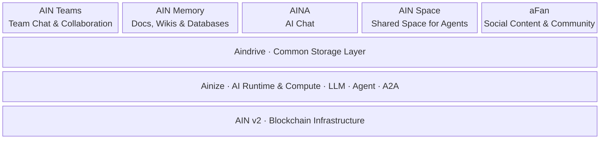

# AI Network 2026: 사람과 AI가 함께 살아가는 생태계

**한국어** · [English](en.md)

> Ensure no human is left behind.
>
> 누구도 뒤처지지 않는 AI의 미래.

[AI Network의 미션](https://www.ainetwork.ai/)은 인간을 중심에 둔 AI 생태계를 만드는 것입니다. AI가 발전할수록 더 많은 사람이 자신의 지식과 경험을 활용하고, 새로운 관계를 맺고, 그 안에서 가치를 만들어낼 수 있어야 합니다.

이를 위해서는 AI를 실행하는 기반부터 일상의 서비스까지 연결되어야 합니다. 내가 가진 자료를 AI가 이해하고, 함께 나눈 대화를 기억하며, 그 기억이 다음 협업과 창작으로 이어져야 합니다. 온라인에서 시작한 관계가 실제 만남으로 이어지는 공간도 필요합니다.

AI Network는 이 연결을 AIN v2, Ainize, Aindrive와 다섯 개의 서비스로 만들어가고 있습니다.

## 각 제품이 맡는 역할

### AIN v2 — 생태계를 지탱하는 블록체인

AIN v2는 네트워크의 활동과 실행 기록을 뒷받침하는 블록체인 기반입니다. AI 서비스가 실행되고 참여자가 기여하는 과정에 공통의 기록과 검증 기반을 제공하는 방향으로 발전합니다. 생태계가 커질수록 그 활동을 안정적으로 지탱하는 것이 이 계층의 역할입니다.

### Ainize — LLM과 에이전트가 실행되고 연결되는 곳

Ainize는 모델 추론, 에이전트 실행, A2A를 통한 에이전트 간 연결을 담당합니다. 지식을 학습하고 검증·공유하는 기능을 통해, 사용자가 제공한 지식이 다른 사람과 에이전트에게도 쓰일 수 있도록 합니다. 서비스 개발자는 이 실행 기반 위에서 자신이 만들고 싶은 사용자 경험에 집중할 수 있습니다. [Ainize GitHub](https://github.com/ainblockchain/ainize)

*Ainize의 지식 탐색·학습 서비스 화면 · [출처](https://github.com/ainblockchain/ainize/blob/main/evidence/screenshots/ainize-ai-home.png)*

### Aindrive — 모든 서비스가 함께 사용하는 데이터 기반

Aindrive는 내 기기의 파일과 폴더를 사람과 에이전트가 권한에 따라 함께 사용할 수 있게 합니다. 사용자는 어떤 자료를 누구에게 열어줄지 정하고, 서비스는 그 자료를 읽고 활용합니다. 생태계 안에서 서비스가 달라져도 필요한 지식과 작업물을 이어 쓸 수 있는 공통 스토리지 계층을 지향합니다. [Aindrive GitHub](https://github.com/ainetwork-ai/aindrive)

### 다섯 개의 서비스 — 협업에서 기억, 대화, 공간과 커뮤니티까지

- **AIN Teams — 팀의 대화와 업무를 한곳에.** 사람과 AI 에이전트가 같은 채널에서 소통하고 함께 일하는 협업 플랫폼입니다. 프로젝트별로 대화와 파일을 모으고, 필요한 에이전트를 불러 자료 조사와 문서 작성을 맡길 수 있습니다. 팀원은 같은 대화 안에서 진행 상황을 확인하고 결과를 검토합니다. 대화가 시작되는 곳에서 업무도 함께 진행하는 것이 AIN Teams의 방향입니다.
- **AIN Memory — 문서와 지식을 한곳에, 필요한 순간에 다시 활용.** 노트, 문서, 위키와 데이터베이스를 함께 만들고 정리하는 AI 워크스페이스입니다. 회의록과 기획안을 페이지로 작성하고, 자료와 할 일을 표나 보드로 관리할 수 있습니다. 여기에 AI가 대화에서 나온 결정과 맥락을 기록하고, 쌓인 자료를 바탕으로 질문에 답합니다. 개인과 팀이 함께 만든 지식을 다음 작업의 출발점으로 만드는 것이 AIN Memory의 방향입니다.
- **AINA**는 AI와 대화하며 질문하고, 자료를 이해하고, 업무를 진행하는 접점입니다. 사용자가 자신의 맥락 안에서 필요한 에이전트와 기능을 쉽게 사용할 수 있도록 발전합니다.
- **AIN Space**는 사람과 에이전트가 만나고 활동하는 공유 공간입니다. 에이전트가 기억과 관계를 이어가며 다른 참여자와 협업하는 디지털 마을을 지향합니다.
- **aFan**은 창작자와 팬이 콘텐츠를 나누고 관계를 쌓는 커뮤니티입니다. 창작 과정과 결과물을 공유하고, 그에 대한 반응과 대화가 다음 창작으로 이어지도록 합니다.

*AIN Teams의 프로젝트 채널과 에이전트·MCP 연동 화면*

## 하나의 생태계로 연결되는 구조

이 구조에서 **AIN v2는 기록과 검증의 기반을, Ainize는 AI 실행과 연결을, Aindrive는 데이터 접근과 공유를 담당합니다.** 그 위의 다섯 서비스는 같은 기반을 서로 다른 일상의 경험으로 전달합니다.

예를 들어, 한 팀이 전시를 준비한다고 생각해볼 수 있습니다. Aindrive에서 기획 자료와 작품 파일을 공유하고, AINA를 통해 자료를 살펴보며 아이디어를 발전시킵니다. AIN Teams의 프로젝트 채널에서는 사람과 에이전트가 역할을 나누고 진행 상황을 공유합니다. AIN Memory에는 기획안, 작품 목록, 회의에서 나온 결정을 정리해 팀이 함께 참고하는 지식 공간을 만듭니다.

이후 AIN Space에서 참여자들이 만나고, aFan에서 창작 과정과 작품에 대한 이야기를 이어갑니다. Uncommon Gallery에서 실제 전시와 만남이 이루어지면, 그 경험은 다시 다음 프로젝트의 자료와 기억이 됩니다. 이것이 우리가 만들고자 하는 연결입니다.

Aindrive는 이 과정의 공통 자료를 연결하고, Ainize는 필요한 모델과 에이전트를 실행합니다. 각 서비스가 맡은 기능은 다르지만, 사용자가 쌓아온 지식과 관계는 다음 활동으로 이어지는 구조입니다.

## 생태계를 연결하는 공통 규약

각 제품이 하나의 생태계로 작동하려면 에이전트가 서로 일을 요청하고, 필요한 자료를 사용하고, 결과를 사용자에게 보여주며, 유료 자원에 대한 대가를 주고받을 수 있어야 합니다. AI Network는 A2A, MCP, AIN-UI, x402를 통해 이 연결을 만들어갑니다.

### A2A — 에이전트와 에이전트를 연결

**A2A(Agent2Agent)**는 서로 다른 환경에서 만들어진 에이전트가 능력을 소개하고, 작업을 요청하고, 진행 상황과 결과를 주고받는 공통 통신 규약입니다. 예를 들어 전시 기획 에이전트가 자료 조사 에이전트에게 작업을 맡기고, 받은 결과를 바탕으로 기획안을 만들 수 있습니다. Ainize에서 실행되는 에이전트와 AIN Teams·AIN Space의 참여자를 연결하는 데 활용합니다. [A2A 공식 문서](https://a2a-protocol.org/latest/)

### MCP — AI와 데이터·도구를 연결

**MCP(Model Context Protocol)**는 AI 애플리케이션이 파일, 데이터베이스, 검색과 같은 외부 자원과 도구를 공통 방식으로 사용하는 규약입니다. Aindrive가 파일 목록 조회와 읽기·쓰기 기능을 MCP로 제공하면, 연결된 AI는 허용된 범위에서 자료를 찾아 활용할 수 있습니다. 사용자는 같은 파일을 서비스마다 반복해서 업로드하는 일을 줄이고, 개발자는 데이터 연결 기능을 재사용할 수 있습니다. [MCP 공식 문서](https://modelcontextprotocol.io/docs/getting-started/intro) · [Aindrive MCP](https://github.com/ainetwork-ai/aindrive#readme)

### AIN-UI — 에이전트의 결과를 사용자가 다루는 화면으로 연결

**AIN-UI**는 A2UI를 확장한 AI Network의 공통 UI 규격과 구현입니다. 파일 목록, 이미지와 문서 미리보기, 업로드, 결제 카드처럼 사용자가 직접 보고 조작할 수 있는 화면을 표현합니다. 이 화면 정보를 MCP, A2A, AG-UI를 통해 전달해, 지원하는 서비스에서 같은 형식으로 보여줄 수 있습니다. Aindrive의 공유 폴더를 AIN Memory 안에서 탐색하는 것처럼, 서비스 사이에서도 작업을 이어가는 데 활용합니다. [AIN-UI GitHub](https://github.com/ainetwork-ai/AIN-UI)

### x402 — 데이터와 서비스 이용을 결제로 연결

**x402**는 HTTP 요청에 결제를 연결하는 공개 규약입니다. 유료 자원을 요청하면 서버가 HTTP 402 응답으로 결제 조건을 알리고, 클라이언트가 결제 승인을 담아 다시 요청하면 서버가 이를 검증해 자원을 제공합니다. Aindrive의 유료 공유나 Ainize의 지식 거래에 활용해, 사람과 에이전트가 필요한 자원에 접근하고 제공자가 대가를 받을 수 있게 합니다. 결제 통화와 네트워크는 각 서비스의 설정에 따릅니다. [x402 공식 소개](https://x402.org/) · [Aindrive](https://github.com/ainetwork-ai/aindrive#readme) · [Ainize](https://github.com/ainblockchain/ainize#readme)

전시 준비 과정에 대입하면, **A2A로 조사 작업을 요청하고, MCP로 공유 자료를 읽고, AIN-UI로 결과와 파일을 보여주며, 유료 자료가 필요할 때 x402로 이용 대가를 지불하는 흐름**입니다. 네 규약은 협업·데이터·화면·결제를 각각 연결해, 여러 제품에서 하나의 작업을 이어갈 수 있도록 돕습니다.

## 2026 로드맵

### Phase 1 (9월 완료). AIN v2 · Ainize 출시 — 실행 기반 구축

- **AIN 블록체인:** 실행 스케줄링과 블록 확정 처리를 개선하고, 스냅샷 저장을 별도 프로세스로 분리했습니다. [변경 코드](https://github.com/ainblockchain/ain-blockchain/commit/1c8ca609978b880bedf841d6e67a55c9e2a62195)
- **Ainize:** OpenAI 호환 API로 모델을 호출하고, 호스팅된 에이전트가 다른 노드의 모델도 사용할 수 있도록 확장했습니다. [API 안내](https://github.com/ainblockchain/ainize-node#readme) · [변경 코드](https://github.com/ainblockchain/ainize-node/commit/0b58a1779aa8aa9cc81b0e2b2907cc713a872741)
- **서비스 연결:** 에이전트의 실시간 응답과 Aindrive 공유 파일 읽기를 연결해, 사용자 자료를 활용하는 AI 서비스의 기반을 마련했습니다. [변경 코드](https://github.com/ainblockchain/ainize-node/commit/5d6548a016edb64dbec5cd3a9860743cfc5a5906)

### Phase 2 (10월). Aindrive 출시 — 내 자료를 AI와 연결

- 내 기기의 파일과 폴더를 필요한 사람과 에이전트에게 공유하는 공통 데이터 기반을 선보입니다.
- 자료의 접근 권한을 사용자가 정하고, 여러 서비스가 허용된 자료를 함께 활용하도록 연결합니다.

[여기에 Aindrive 영상 첨부]

### Phase 3 (11월). AIN Teams · AIN Memory · AINA 출시 예정 — 대화, 지식, AI를 일상의 업무로

- **AIN Teams:** 팀원과 에이전트가 한 채널에서 소통하고 작업해, 업무 요청부터 결과 검토까지 이어갑니다.
- **AIN Memory:** 문서·위키·데이터베이스에 팀의 지식과 결정을 모아, 필요한 정보를 찾고 다음 작업에 다시 활용합니다.
- **AINA:** Aindrive로 연결한 자료를 바탕으로 질문하고 도움을 받아, 자신의 업무 맥락에 맞게 AI를 사용합니다.

### Phase 4 (12월). AIN Space · aFan 출시 예정 — Uncommon Gallery로 이어지는 관계

- AIN Space에서 사람과 에이전트가 만나고, Uncommon Gallery의 전시·모임과 연결되는 온라인 활동 공간을 만듭니다.
- aFan에서 작가와 팬이 창작 과정과 감상을 나누며, 갤러리 방문 전후에도 관계를 이어가도록 합니다.
- 온라인의 대화가 오프라인의 만남으로, 현장의 경험이 다시 콘텐츠와 협업으로 이어지는 커뮤니티를 만듭니다.

*AIN Space의 Happy Village 공개 화면 · 2026-09-29 캡처 · [출처](https://ainspace.ainetwork.ai/)*

*aFan 저장소의 기존 앱 소개 이미지*

이 방향은 AIN Space를 디지털 마을로, Uncommon Gallery를 온라인에서 시작한 관계가 현실로 이어지는 공간으로 소개하는 [AI Network의 비전](https://www.ainetwork.ai/)과 맞닿아 있습니다.

## 2026년 말까지, AIN으로 구동되는 완전한 생태계

우리의 목표는 **2026년 말까지 AIN으로 구동되는 완전한 생태계를 완성하는 것**입니다.

AIN v2 위에서 AI가 실행되고, Aindrive로 자료가 연결되며, 그 위에서 사람들은 함께 일하고 기억하고 창작합니다. AIN Space와 aFan에서 만들어진 관계는 Uncommon Gallery의 실제 만남으로 이어집니다.

내가 가진 지식이 쓰이고, 함께한 경험이 남고, 그 과정에서 새로운 관계와 기회가 생기는 것. AI Network는 누구도 뒤처지지 않는 AI의 미래를 이러한 일상의 경험으로 만들어가겠습니다.
